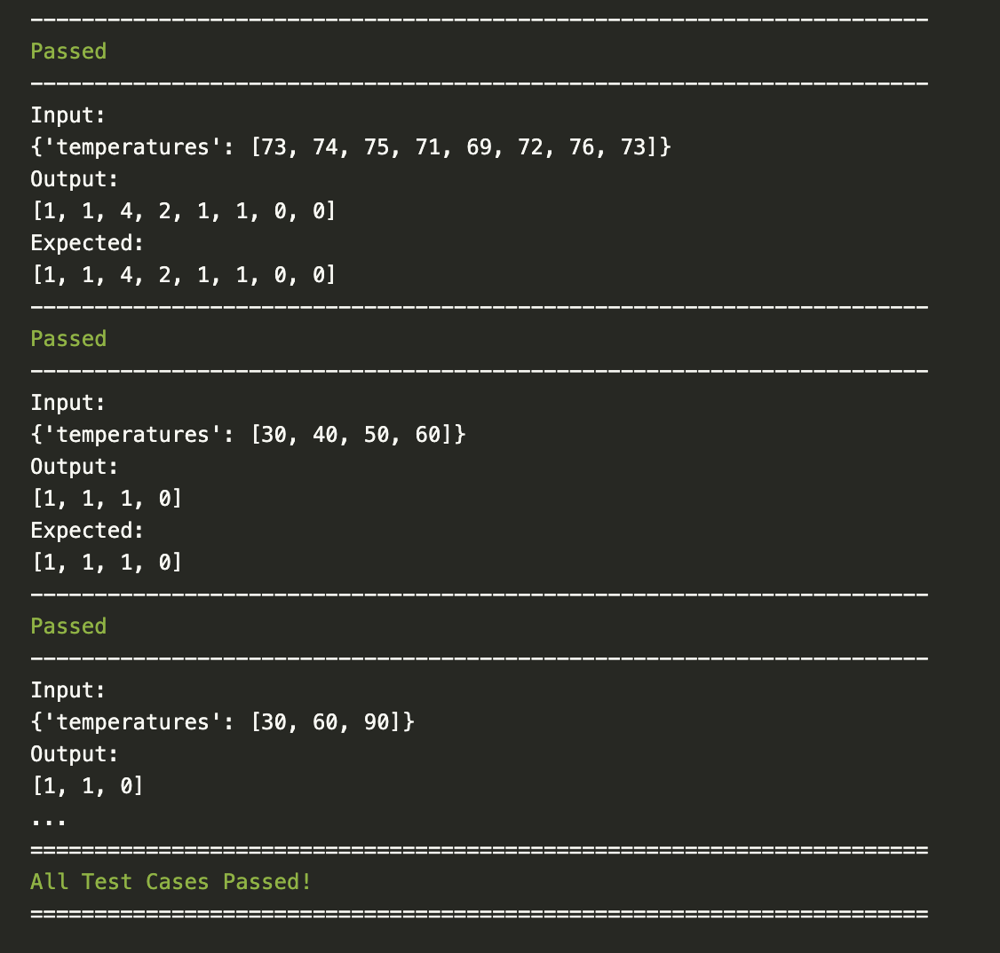

# Overview


A python package with tools to let you try coding problems and check your code against your own test cases.

Sites like LeetCode and Project Euler have great problems you can solve to improve your data-structures and algorithm knowledge.

But LeetCode's IDE isn't fun to code in, and harder to debug in.

Project Euler has no web IDE at all.

This tool allows you to quickly start solving those problems and add test-cases quickly.

# Installation

Install using pip:

```text
$ pip install leetcode-local-runner
```

or with [Poetry](https://python-poetry.org/):

```text
$ poetry add leetcode-local-runner
```

# Usage

1. Install the library.
2. Pick a problem to solve from either LeetCode or Project Euler.
3. Copy the code in the editor into a python file.
   ```py
   class Solution:
    def dailyTemperatures(self, temperatures: List[int]) -> List[int]:
        pass
   ```
4. Create your own test-cases and pass them into the LeetCode class like so:
```py
test_cases = [
    {"temperatures": [73, 74, 75, 71, 69, 72, 76, 73]},
    {"temperatures": [30, 40, 50, 60]},
    {"temperatures": [30, 60, 90]},
]
expected_outputs = [
    [1, 1, 4, 2, 1, 1, 0, 0],
    [1, 1, 1, 0],
    [1, 1, 0],
]

lc = LeetCode(test_cases=test_cases, expected_outputs=expected_outputs, fn=Solution().isSameTree)
lc.run_test_cases()
```


# Requirements
- Python >= 3.10
